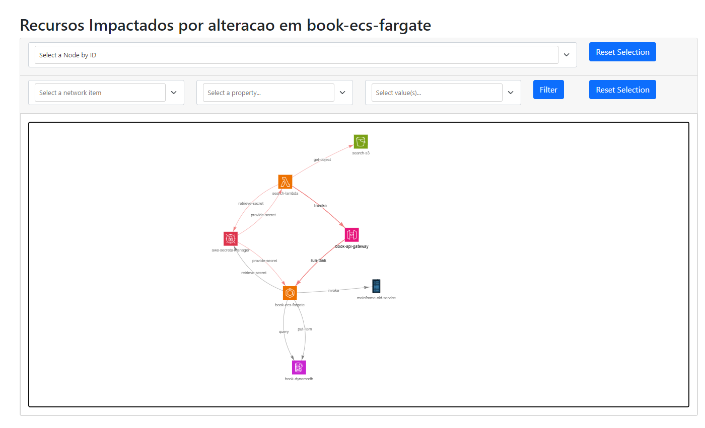

# Projeto de Visualização de Grafos

Este projeto é uma aplicação Python que utiliza as bibliotecas `networkx`, `pandas`, `BeautifulSoup` e `pyvis` para
criar e visualizar grafos a partir de dados em um arquivo CSV. O objetivo principal é identificar e visualizar os
recursos impactados por uma alteração em um recurso específico em um grafo de recursos.

Por exemplo, considere a seguinte lista de recursos representados por um csv:

| resource_id_from | resource_id_to   | integration_type | metadata  |
|------------------|------------------|------------------|-----------|
| search-lambda    | book-api-gateway | invoke           | metadata1 |
| book-api-gateway | book-ecs-fargate | run-task         | metadata2 |
| book-ecs-fargate | book-dynamodb    | query            | metadata3 |
| ...              | ...              | ...              | ...       |

É possível obter o grafo dos recursos impactados por uma alteração no recurso `book-api-gateway`:



## Requisitos

- Python 3.7+
- Bibliotecas Python: `networkx`, `pandas`, `BeautifulSoup`, `pyvis`

## Instalação

Primeiro, é recomendado criar e ativar um ambiente virtual Python:

```bash
python3 -m venv venv
source venv/bin/activate  # No Windows, use `venv\Scripts\activate`
```

Em seguida, instale as dependências do projeto a partir do arquivo `requirements.txt`:

```bash
pip install -r requirements.txt
```

## Uso

O script principal do projeto é `main.py`. Ele lê um arquivo CSV chamado `recursos.csv`, cria um grafo a partir dos
dados e visualiza o grafo em um arquivo HTML.

Para executar o script, use o seguinte comando:

```bash
python main.py
```

## Funcionalidades

O projeto inclui as seguintes funcionalidades:

- `adicionar_titulo_html(file_path, title, h1_text)`: Adiciona um título e um cabeçalho h1 a um arquivo HTML.


- `criar_grafo(file_path)`: Cria um grafo a partir de um arquivo CSV.


- `visualizar_grafo(G, name="grafo.html", impacted_nodes=set(), impacted_color="red", altered_resource=None, altered_color="green")`:
  Visualiza um grafo em um arquivo HTML.


- `encontrar_recursos_impactados_primeiro_nivel(G, recurso_alterado)`: Encontra os recursos impactados no primeiro nível
  por uma alteração em um recurso específico.


- `encontrar_recursos_impactados(G, recurso_alterado)`: Encontra todos os recursos impactados por uma alteração em um
  recurso específico.


- `run()`: Executa o script principal do projeto.

## Contribuição

Contribuições são bem-vindas. Para contribuir, por favor, abra um issue ou um pull request.

## TODO

- [ ] Adicionar suporte a diferentes fontes de dados (ex: sqlite, AWS DynamoDB, AWS S3, etc.)
- [ ] Implementar uma interface gráfica para gerenciar os grafos
- [ ] Implementar uma interface gráfica para visualizar os grafos
- [ ] Expor a aplicação como uma API REST
- [ ] Implementar testes unitários